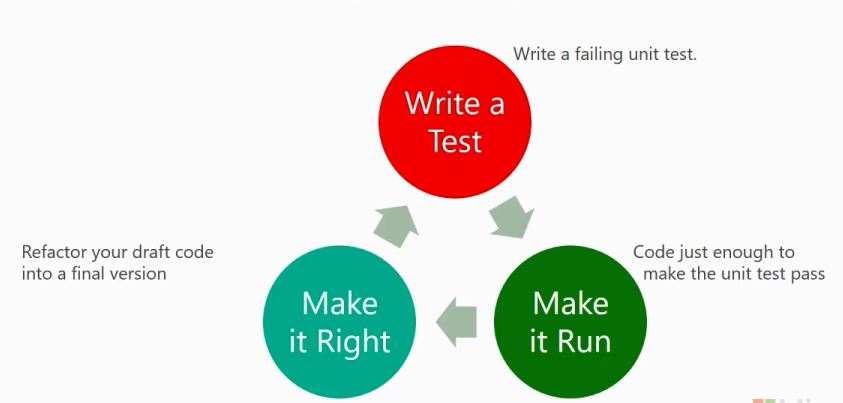

# DevOps Testing Guide

## Unit-Testing-your-Database-Changes

- [Unit Testing Your Database Changes](https://channel9.msdn.com/Shows/DevOps-Lab/Unit-Testing-your-Database-Changes)

- [tsqlt:Database Unit Testing Framework](tsqlt.org)

## Mocking

## Unit Test Coverage

## Unit Test Generator

- [IntelliTest](./demos/README.md#IntelliTest) explores your .NET code to generate unit tests.

- [Unit Test Boilerplate Generator](https://github.com/Microsoft/UnitTestBoilerplateGenerator) extension for Visual Studio that generates a unit test boilerplate from a given class.

## Test Pyramid

Its essential point is that you should have many more low-level unit tests than high level end-to-end tests running through a GUI.

- [Testing Pyramids & Ice-Cream Cones](https://watirmelon.blog/testing-pyramids/)

## Testing Tree

- Unit Test
- Integration Test
- Acceptance Test
- UI Test
- Load and Performance Testing
- Manual and Exploratory Testing

## Test-Driven Development

- Test defines what code **will** do.
- More intentional development.
- Red/Green/Refactor

  

## Anatomy of a unit test

- Indicator of a test method
- Arrange
- Act
- Assert

## .NET Core Unit Testing Framework

### [xUnit](./docs/xunit.md)

[xUnit.net](https://github.com/xunit/xunit) is a free, open source, community-focused unit testing tool for the .NET Framework.

## Python Unit Testing Framework

- built-in unittest
- pytest
- nosetests

## JavaScript/Node.js Unit Testing Framework

- Jasmine
- Mocha

## Reference

- [DevOps Testing 00:00:00-00:15:30](https://mva.microsoft.com/en-US/training-courses/18250?term=testing)