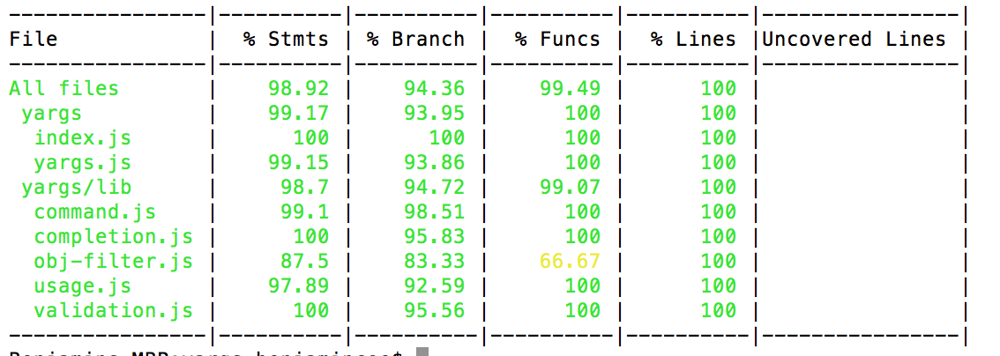

# Mocha

"Mocha is a feature-rich JavaScript test framework running on Node.js and the browser, making asynchronous testing simple and fun."

http://www.ruanyifeng.com/blog/2015/12/a-mocha-tutorial-of-examples.html

## Istanbul / nyc javascript code coverage

### Features

- A collection of reporters, providing both terminal and HTML output.

  

- Support for the most popular JavaScript testing frameworks